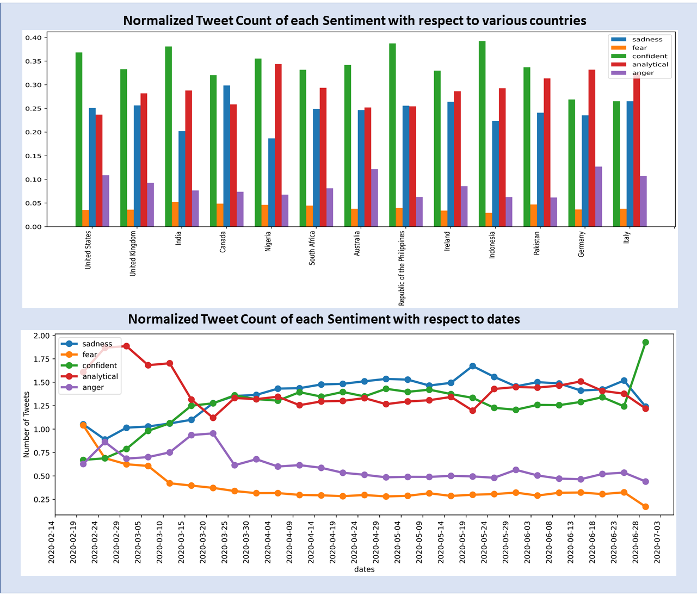
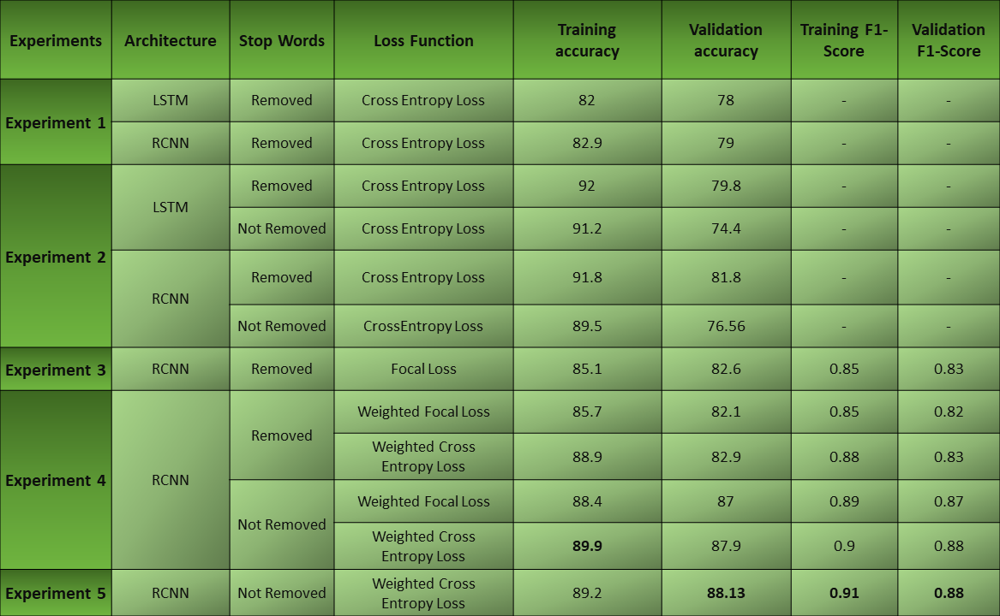
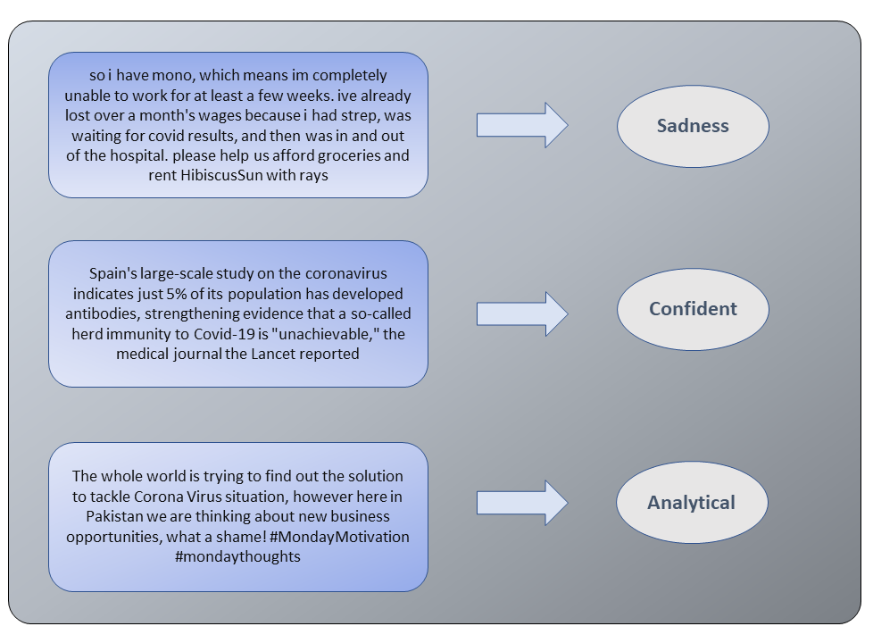

## Group Members:
Project for Deep Learning Spring 2020 at Information Technology University Lahore Pakistan
Group Number : G2H
Abdul Basit     (abdul.basit@itu.edu.pk)
Obaid           (mscs19001@itu.edu.pk)
M. Shahryr Khan (mscs19002@itu.edu.pk)
Hadi Mustafa    (mscs19004@itu.edu.pk)
Usama Irfan     (mscs19008@itu.edu.pk)

Supervised By: Dr. Mohsen Ali
## Abstract

Covid19, since its inception, has had a huge impact on people's life. Since different governments have announced lock-down to confine the people at home to mitigate the spread of disease, people have turned to social media to express their concerns and their feelings about the situation. An insight into the mindset of the people is an invaluable commodity at dire times such as these. Analysis of this frail yet testing phase can give helpful and important insights in to the situation which would surely lead to better and informed decisions at higher levels to curb and contain not only the deadly disease but the rising panic and frustration as we find in our report. In this project, we have done a sentiment analysis of Covid19 related tweets which is essentially a test classification problem. We employ a recurrent convolution neural network which uses a recurrent structure to capture more contextual information. This also uses a max-pooling layer to determine which words have more weight while describing sentiment of a tweet. We have also used weighted cross entropy and focal loss to address class imbalance in our dataset. Using this method we were able to acheive 89% accuracy on our testset. Our results are satisfactory which show overall positive behavior of the people towards this pandemic across all countries.

## Dataset Analysis

## Countrywise and Datewise analysis

## Results

## Demo

